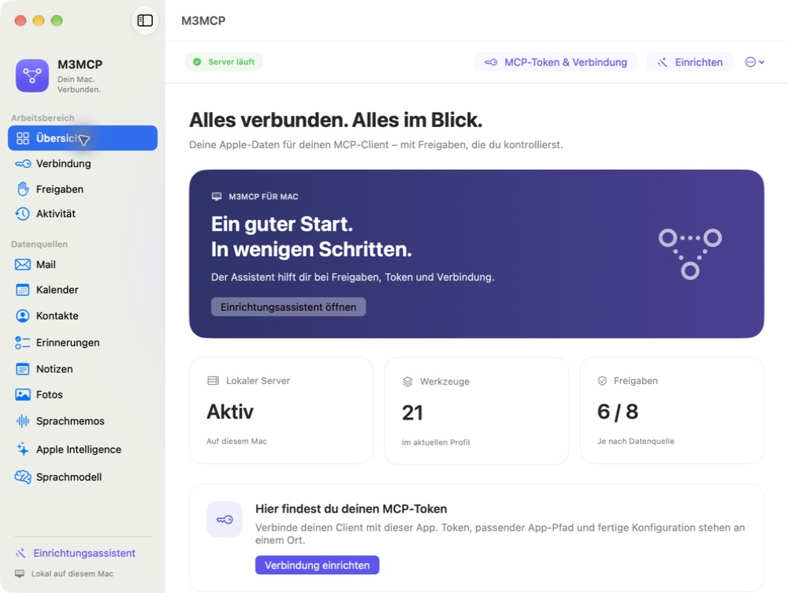

# LocalMCP

Version 1.0.1: German and English macOS app; App Store review preparation is in progress.


[](https://github.com/GodModeAI2025/AppleMCP/actions/workflows/ci.yml)

LocalMCP is a native macOS 15+ MCP server for bounded access to local Apple data and selected Apple Intelligence APIs. It consists of a SwiftUI app that holds macOS privacy permissions and a `stdio` bridge used by MCP clients.

Version 1.0.1 starts in a **default-safe profile**. The bridge advertises 21 observation or local-processing tools. Calendar mutations, permission UI, and user-created Shortcuts are absent unless the corresponding launch-time environment variable is explicitly enabled. Calendar mutations and Shortcut invocations also require a one-call approval in the native app.

LocalMCP is local-first, but it is not an isolation boundary for every process running as you. Read [Security model](docs/SECURITY_MODEL.md) before granting Full Disk Access or enabling optional tools.

[Product website](https://godmodeai2025.github.io/AppleMCP/) · [Original app screenshots](docs/SCREENSHOTS.md)



## Name and compatibility

The app is now **LocalMCP** (formerly M3MCP). Its bundle is `LocalMCP.app`.
The repository URL remains `GodModeAI2025/AppleMCP`. Existing bundle identifiers,
keychain entries, preferences, Application Support paths, `M3MCP_TOKEN`,
`M3MCP_ENABLE_*` variables, the `m3mcp` client entry and internal Swift module /
bridge names are retained for compatibility. These are technical identifiers,
not the displayed product name. For an existing client configuration, update the
app path to `LocalMCP.app` while keeping its token and other settings.

## Access methods and permissions

| Source | Access method | macOS permission or requirement |
|---|---|---|
| Mail | Local Envelope Index (SQLite) and bounded `.emlx` parsing | Full Disk Access when the local Mail store is protected |
| Calendar | EventKit | Full Calendar Access; optional writes are separately gated |
| Contacts | Contacts.framework | Contacts |
| Reminders | EventKit | Reminders |
| Notes | Notes.app Apple Events | Automation for Notes |
| Photos | Photos.framework | PhotoKit calls this `.readWrite`; LocalMCP's exposed Photos tools do not mutate the library |
| Voice Memos | Local `CloudRecordings.db`, in-file transcripts, and on-device speech recognition | Full Disk Access; Speech Recognition only for the legacy recognizer fallback during a fresh transcription |
| Foundation Models | Apple's on-device language model | Apple Intelligence availability on macOS 26 |
| Image Playground | Native ImagePlayground API | Image Playground availability on macOS 15.4+ |
| User Shortcuts | `/usr/bin/shortcuts` with JSON over standard input | Disabled by default; behavior depends on the user's Shortcut |

All 21 default tools preflight any TCC state they require and do not request a permission or open System Settings. When fresh Voice Memos transcription reaches the legacy `SFSpeechRecognizer` fallback, missing Speech Recognition permission returns an error instead of prompting; the macOS 26 `SpeechAnalyzer` path does not use that legacy authorization callback. The native **Freigaben** page and setup assistant can request individual permissions and open System Settings after an explicit click, including in the default profile. Remote MCP permission tools remain disabled unless both app and bridge are launched with `M3MCP_ENABLE_PERMISSION_UI=1`. An Apple framework can still present system behavior while acquiring an on-device model asset.

`permissions_status` never launches Notes or enables an Automation prompt. An explicit
`notes_search` or `notes_read` may start Notes hidden when it is closed, because macOS reports a
closed Apple Event target as “process not found” even when access was previously granted. The tool
then repeats the preflight with prompting still disabled. Cancellation is checked before that launch
and again before AppleScript admission. The synchronous Automation determination itself runs on a
background worker, not the app's main thread.

## Data freshness and refresh

There is no background polling interval. Each MCP data-tool call is the refresh: it performs a new
provider query against the current local Calendar, Contacts, Mail, Notes, Photos, Reminders, or
Voice Memos state. Framework-owned synchronization can still determine when an Apple data source
observes an external change. Generated Voice Memo transcripts are the one persistent result cache;
call transcription with `prefer_stored: false` to request fresh recognition.

The native permissions view refreshes when it appears, after a permission request, and when its
Refresh button is pressed. `permissions_status` itself performs a new status check on every MCP
call. Launch-time tool opt-ins are intentionally immutable and require both app and bridge to be
restarted.

## Downloadable release candidates

After a maintainer reviews and publishes a draft candidate, its GitHub release can contain
`LocalMCP.app.zip` and `LocalMCP.app.zip.sha256`. The archive contains the app, MCP bridge, Apache-2.0
license, and retained third-party notices. The automated candidate is Apple Silicon (`arm64`) only,
ad-hoc signed, and unnotarized; it is not a production-grade macOS distribution.

```bash
curl -LO https://github.com/GodModeAI2025/AppleMCP/releases/latest/download/LocalMCP.app.zip
curl -LO https://github.com/GodModeAI2025/AppleMCP/releases/latest/download/LocalMCP.app.zip.sha256
shasum -a 256 -c LocalMCP.app.zip.sha256
gh attestation verify LocalMCP.app.zip \
  --repo GodModeAI2025/AppleMCP \
  --signer-workflow GodModeAI2025/AppleMCP/.github/workflows/release.yml  # optional
unzip LocalMCP.app.zip
```

The checksum detects a mismatch against the file recorded in that same GitHub release; by itself it
does not establish independent publisher authenticity. The GitHub build-provenance attestation
binds the ZIP to this repository's release workflow, but does not replace Apple Developer ID
signing and notarization. If Gatekeeper blocks the app, review its origin and verification results
before choosing **Open Anyway** in System Settings → Privacy & Security. Do not remove quarantine
metadata merely to suppress the warning.

An ad-hoc candidate may need Full Disk Access and other privacy grants again after each binary
update. For a stable local development identity, build from source and use
`script/create_local_identity.sh` plus `script/install_local.sh`. Public production distribution
still requires a separately protected Developer ID, hardened-runtime, trusted-timestamp,
notarization, and stapling pipeline.

## Native setup assistant (0.3.1 local build)

The app opens a four-step German setup assistant on first launch. Reopen it with **Einrichten**.
Before setup, **Nutzung auf eigene Gefahr** explains possible data changes, deletion, disclosure,
iCloud propagation and backup precautions. Its checkbox is initially unchecked. The server stays
stopped until the user explicitly confirms; cancelling does not confirm. Existing installations also
see this notice once after updating. The versioned confirmation is stored locally in preferences,
independently of setup progress, macOS permissions and optional tool approvals. Reopen the notice
with **Risikohinweis** in the assistant. This onboarding confirmation is not an authorization or
security boundary against other software running as the same user.
**Verbindung** exposes a masked token, **MCP-Token kopieren**, and complete Codex TOML or MCP JSON
configuration. The configuration preview always uses a placeholder; the copy action includes the
real token and current bundled bridge path. Paste only into the intended client. Copied credentials
expire from the clipboard after 90 seconds if the clipboard has not changed; revealed tokens hide
after 30 seconds or when the window loses application focus. No client configuration is edited automatically.

**Lokale Verbindung testen** starts the bundled bridge with the current token and checks
`source_status`, exercising server authentication and peer pinning without reading personal contents.
The local test does not establish that an external client is configured. Complete the client setup
and make a first request there. On another Mac, use its newly generated token and grant its own
privacy permissions.

## Quick start

### Build and test

```bash
swift build
swift test
```

Building requires a macOS 26 SDK because `Package.swift` weak-links `FoundationModels`; the
resulting app keeps a macOS 15 deployment target.

To build a signed local app bundle and launch the default-safe profile:

```bash
./script/build_and_run.sh
```

For a persistent release build and LaunchAgent, first create or provide a stable signing identity,
then run the staged installer:

```bash
./script/create_local_identity.sh
./script/install_local.sh
```

The installer builds the release configuration, validates the signed bundle, stages replacements,
and commits them only after launchd and the Unix-socket health check succeed. It builds its bridge at
`.build/release/M3MCPBridge` and installs a copy of it into the bundle; the one-off development
commands below use `.build/debug/M3MCPBridge`.

**Point the MCP client at the bridge that sits next to the app it will talk to.** The app accepts
connections only from the `M3MCPBridge` beside its own executable, so:

| The app you run | The bridge to configure |
|---|---|
| `swift build` plus `.build/<config>/M3MCPApp` | `.build/<config>/M3MCPBridge` |
| `./script/build_and_run.sh` | `dist/LocalMCP.app/Contents/MacOS/M3MCPBridge` |
| `./script/install_local.sh` | `~/Applications/LocalMCP.app/Contents/MacOS/M3MCPBridge` |
| A downloaded release ZIP | `LocalMCP.app/Contents/MacOS/M3MCPBridge` |

After an install the copy in `.build/release/` is refused with `403`, even though it was built from
the same source: the installer re-signs the staged bridge with your stable certificate, which changes
its code directory hash. That is the pin working, not a bug. The installer prints the path to use.

The app listens on a Unix domain socket at:

```text
~/Library/Application Support/M3MCP/mcp.sock
```

The parent directory is mode `0700` and the socket is mode `0600`. A minimal health check is:

```bash
curl --unix-socket "$HOME/Library/Application Support/M3MCP/mcp.sock" \
  http://localhost/health
```

`/health` omits recent tool activity and is the one route that answers without a capability token,
because it is the readiness probe the installer waits on. Every other route, `/status` and every
tool call included, needs `Authorization: Bearer <token>`. `/status` includes recent inputs and
bounded outputs and should be treated as sensitive local diagnostics.

```bash
curl --unix-socket "$HOME/Library/Application Support/M3MCP/mcp.sock" \
  -H "Authorization: Bearer $M3MCP_TOKEN" \
  -H 'Content-Type: application/json' -d '{}' \
  http://localhost/tools/source_status
```

### Local installation and service lifecycle

The local installer distinguishes a healthy server from an installed app awaiting setup.
“Installed; setup is pending” means you should open the installed app and review its risk notice
at your own pace. No server or tools are enabled before consent. Do not run a development copy
first as an installation workaround. Genuine startup failures still roll back the installation.

If keychain access is pending, open the installed app and choose **Server > Start** to authorize
access explicitly. Automatic startup does not display a blocking keychain panel. Existing tokens
are retained; do not delete a token merely to make installation finish. A stable signing identity
is necessary for updates, but preserved privacy permissions alone do not prove keychain access.

**Self-signed local builds:** native testing found that macOS can add a `cdhash` partition to
the token's legacy-keychain access rules. This binds access to the particular executable build,
even when its certificate and bundle identifier remain unchanged. A separately built update can
therefore require explicit keychain authorization again. Silent access across self-signed rebuilds
is not guaranteed. The installer retains the token and reports pending access; it does not remove
keychain restrictions or rotate the token to conceal this condition. This finding concerns the
local legacy-keychain path. TestFlight uses the separate sandbox Data Protection keychain.

The local LaunchAgent starts at login and restarts unsuccessful exits. Deliberately quitting the
app leaves it stopped until you reopen it or log in again; unconditional KeepAlive is not enabled.
Use the health check above to verify the listener, rather than relying on a process ID. A bridge
call to a stopped server returns an MCP tool error (`isError: true`); a successful search with no
matches remains a successful empty result.

### Connect an MCP client

Claude Desktop example:

```json
{
  "mcpServers": {
    "applemcp": {
      "command": "/path/to/AppleMCP/.build/debug/M3MCPBridge",
      "env": { "M3MCP_TOKEN": "<token from the app's Server menu>" }
    }
  }
}
```

Claude Code example:

```bash
claude mcp add applemcp -e M3MCP_TOKEN="<token>" -- /path/to/AppleMCP/.build/debug/M3MCPBridge
```

The app creates the capability token on its first start and keeps it in the login keychain. Copy it
with Verbindung → MCP-Token kopieren and put it in the client's configuration. Without it the app
refuses every tool call. The bridge can also read the item from the keychain, which works only for
the binary the item is on the ACL of and never prompts, because an MCP client gives the bridge no
session in which a panel could be answered.

The app must be running while the bridge is in use. The app and bridge independently resolve their immutable security policy at process launch, so optional features must be enabled for both processes.

## Default-safe tools (21)

These tools are advertised with no security opt-in:

| Area | Tools |
|---|---|
| Status | `source_status`, `permissions_status` |
| Calendar reads | `calendar_search`, `calendar_read_event`, `calendar_list_calendars` |
| Contacts | `contacts_search` |
| Mail | `mail_search`, `mail_list_mailboxes`, `mail_read` |
| Reminders | `reminders_search` |
| Notes | `notes_search`, `notes_read` |
| Photos | `photos_search`, `photos_albums` |
| Voice Memos | `voicememos_search`, `voicememos_read`, `voicememos_transcript`, `voicememos_audio`, `voicememos_transcribe` |
| Local generation | `ai_summarize`, `ai_image_playground` |

"Default-safe" does not mean side-effect free at the filesystem level. Transcription can write an owner-only transcript cache, and Image Playground returns an owner-only temporary PNG. Returned PNGs remain available to the caller and are eligible for exact-name, same-owner stale cleanup after 24 hours. Default-safe means the catalog does not mutate the user's Calendar, display permission UI, or run arbitrary user-created automation.

Resource bounds that affect results:

- Local `.emlx` parsing reads at most 4 MiB of message source and limits returned body content to 8,000 characters; explicit truncation markers may be appended. Mail's SQLite connection rejects values above 256 KiB before Swift string construction; invalid UTF-8 and embedded NUL also fail closed. Recipient joins fail closed above 20,000 rows or 1,000,000 SQLite VM instructions. Mailbox listing probes one row past its 20,000-row scan budget and exposes `scan_capped` plus `total_exact`; search and detail reads fail closed rather than use an incomplete mailbox map. `mail_search` and `mail_list_mailboxes` keep their encoded `ToolResponse` at or below 7 MiB by returning only a complete prefix of items; `meta.response_budget_capped`, `has_more`, and `truncated` disclose that bound.
- `notes_search` requests at most 1,200 AppleScript characters per body preview and then applies a 4,800-byte UTF-8 field ceiling. `notes_read` returns at most 65,536 characters and sets `metadata.content_truncated` when the note was longer.
- `photos_albums` inspects at most 2,000 albums and returns 50 by default, at most 200. Its metadata distinguishes scan-budget, output-limit, and title-content truncation.
- Notes Automation preflights and Notes AppleScripts share one process-wide synchronous Apple Event
  slot. Each native Automation determination has a 30-second caller deadline, and AppleScripts have
  an 8-second caller timeout. Because neither `AEDeterminePermissionToAutomateTarget` nor in-process
  `NSAppleScript` execution has a safe cancellation primitive, a timed-out or cancelled native call
  retains the slot until it actually returns; later permission checks and Notes calls fail fast
  instead of accumulating blocked workers. The caller's cancelled or timed-out result is final, so
  a late native result is ignored.
- Voice Memo detail IDs must be canonical positive decimals returned by search, and search queries cannot exceed 4,096 UTF-8 bytes. Recording contents are opened no-follow through a verified directory descriptor and must retain the owner/type/link/device/inode identity observed during resolution. Snapshot SQLite values/rows are capped at 256 KiB before materialization, database text has smaller per-field byte caps, and returned title/filename/label/path values are independently bounded. Base64 audio reads default to 4,000,000 bytes and cannot exceed 5,000,000 bytes; use `format: "path"` for larger recordings. Transcript-cache entries cannot exceed 16 MiB, while any one returned transcript is capped at 750,000 UTF-8 bytes and reports truncation metadata. Timestamp-segment metadata is emitted as a complete JSON array of at most 40,000 UTF-8 bytes and reports both the returned count and whether later segments were omitted.
- Voice Memo transcription accepts `timeout_seconds` from 10 through 1,800 (default 300). Analyzer and legacy fallback share that one monotonic budget; fallback receives only the remainder, including authorization/capability and audio-metadata preflight. Each native path is single-flight, and its slot plus verified input descriptor remain retained until cancellation-ignoring framework work actually exits. Legacy cleanup specifically waits for both serialized PCM feeder shutdown and `SFSpeechRecognitionTask.state == .completed`; `.canceling` does not release the slot. The bridge applies one absolute 1,830-second monotonic deadline across connect, request delivery, provider wait, and incremental response framing, preserving a 30-second delivery margin beyond the maximum provider deadline.
- Local HTTP requests are bounded to 32 KiB of headers, 1,048,576 body bytes (1 MiB), and a 15-second absolute receive deadline. A persistent owner-only per-endpoint start lock serializes stale-socket handling and bind across competing app processes. An existing socket is probed nonblocking under one 250 ms monotonic deadline; timeout or an ambiguous error preserves the endpoint and aborts startup. App-to-bridge response bodies are capped at 8 MiB; an oversized provider result becomes a small HTTP 413 response rather than an unreadable success. A blocked response write has its own 15-second absolute deadline. If JSON-string escaping would still expand an otherwise valid result beyond the bridge's separate 16 MiB stdout limit, the bridge returns a small normal tool error for that request ID and keeps the writer usable.

### Mail flag metadata (marker colors)

`mail_search` reads the marker colors Apple Mail stores in the `flags` bitmask of the Envelope
Index and exposes them as item metadata; `mail_read` returns the same metadata for one message.
Two parameters extend the search:

- `flagged_only` (boolean, default false): only return flagged (marked) messages.
- `flag_color` (string, maximum 256 characters): filter flagged messages by marker color.
  Accepts a comma-separated list of names or codes — `red/rot=0`, `orange=1`, `yellow/gelb=2`,
  `green/grün=3`, `blue/blau=4`, `purple/lila=5`, `gray/grau=6`. Setting `flag_color` implies
  `flagged_only`. Invalid input, including input that consists only of separators (`","`),
  is rejected with a clear error instead of returning an empty result.

Per item, `metadata.flagged` reports the marked state; only for flagged messages do
`metadata.flag_color` (raw code) and `metadata.flag_color_name` appear. An unknown code is
reported as `unknown`, never as a failure.

The color lives in bits 39–41 of `flags` (`((flags >> 39) & 7)`), verified against the real
Mail index on 2026-09-13 (macOS 26, Index V10):

| Code | Colour | Canonical name | German alias |
|---|---|---|---|
| 0 | Red | red | rot |
| 1 | Orange | orange | orange |
| 2 | Yellow | yellow | gelb |
| 3 | Green | green | grün / gruen |
| 4 | Blue | blue | blau |
| 5 | Purple | purple | lila |
| 6 | Gray | gray | grau |
| 7 | invalid | unknown | — |

Caveats baked into the implementation: the `flag_color` database column is unreliable and
ignored; unmarked messages can still carry leftover color codes in the bits (Mail does not
clear them when unmarking), so filters and metadata always combine `flagged = 1` with the
code; code 7 is invalid and reported as `unknown`.

Because Apple can change the bit layout in a future macOS version, the mapping can be
re-verified against the live index with read-only SQL:

```sql
SELECT ROWID, flagged, ((flags >> 39) & 7) FROM messages WHERE ROWID IN (…);
```

Re-verification procedure: mark seven fresh test messages, one in each of the seven colors,
read their codes with the SQL above, and compare against the table. If the codes diverge,
treat this documentation and the provider mapping as stale.

## Optional tool groups

Each group is disabled when its variable is absent, empty, malformed, or false. Accepted true values are `1`, `true`, `yes`, and `on` (case-insensitive).

| Environment variable | Tools enabled | Additional control |
|---|---|---|
| `M3MCP_ENABLE_CALENDAR_MUTATIONS=1` | `calendar_create_event`, `calendar_update_event`, `calendar_delete_event`, `calendar_create_calendar`, `calendar_delete_calendar`, `calendar_undo_write` | Native approval for every call that writes |
| `M3MCP_ENABLE_PERMISSION_UI=1` | `permissions_request`, `permissions_open_settings` | macOS owns the resulting prompt or settings UI |
| `M3MCP_ENABLE_USER_SHORTCUTS=1` | `ai_writing_tools`, `ai_translate` | Native approval for every call; Shortcut behavior is open-world |

To launch a previously built app bundle with all three groups enabled:

```bash
/usr/bin/open -n \
  --env M3MCP_ENABLE_CALENDAR_MUTATIONS=1 \
  --env M3MCP_ENABLE_PERMISSION_UI=1 \
  --env M3MCP_ENABLE_USER_SHORTCUTS=1 \
  /path/to/AppleMCP/dist/LocalMCP.app
```

For the persistent LaunchAgent installed by `script/install_local.sh`, prefix the installer command
with only the groups to retain, for example
`M3MCP_ENABLE_PERMISSION_UI=1 ./script/install_local.sh`. The installer persists only explicit true
values for the three fixed policy variables; a later install run regenerates that policy from its own
environment. Installation commits only after launchd reports the replacement job and its Unix-socket
`GET /health` response parses with a top-level `ok: true` within a bounded startup window. Otherwise
the installer restores the previous app bundle and LaunchAgent and attempts to restart the previous
service.

Pass the same variables to the bridge in the MCP client configuration, alongside the capability
token, and use the bridge path from the table above for the app you actually run:

```json
{
  "mcpServers": {
    "applemcp": {
      "command": "/path/to/AppleMCP/.build/release/M3MCPBridge",
      "env": {
        "M3MCP_TOKEN": "<token from the app's Server menu>",
        "M3MCP_ENABLE_CALENDAR_MUTATIONS": "1",
        "M3MCP_ENABLE_PERMISSION_UI": "1",
        "M3MCP_ENABLE_USER_SHORTCUTS": "1"
      }
    }
  }
}
```

Enable only the groups you need. Environment opt-in makes tools available; it does not pre-approve Calendar or Shortcut calls. For those calls, the app displays the tool name and a bounded, credential-redacted argument preview. Denial, dismissal, timeout, cancellation, or the absence of a usable app window rejects that one call. Approval is not reusable. A call that carries `dry_run: true` writes nothing and shows no sheet, because there is nothing to consent to; see below.

Cancellation is best-effort, cooperative interruption, not rollback. A client cancellation or disconnect is propagated to in-flight work where the underlying API supports interruption, but an already-raised macOS permission prompt, a running Automation determination, or a running in-process `NSAppleScript` call can remain until the system operation finishes. The caller still returns promptly, and the shared Apple Event slot remains held until that native operation actually ends. A Calendar save/delete or Shortcut action that already happened is not reversed by the cancellation. For a single event, `calendar_undo_write` can reverse it afterwards, but only from the token in a response a cancelled caller may never have received. Read back Calendar state and inspect Shortcut effects before retrying a cancelled call.

### User-created Shortcut contract

The optional `ai_writing_tools` and `ai_translate` tools run Shortcuts named exactly `Writing Tools` and `Translate`. A Shortcut receives a versioned JSON document and must return non-empty UTF-8 plain text. The direct-distribution build uses CLI standard input with 1 MiB output/error limits and a 60-second process timeout. The sandbox integration uses typed Shortcuts Events; its entitlement and runtime verification are still pending. A user-created Shortcut can make network requests, modify files, or perform any other action its author added; LocalMCP cannot constrain those actions.

The complete input schemas and setup notes are in [User Shortcut contract](docs/SHORTCUTS.md).

### Dry run, undo, and what neither covers

Two separate questions sit in front of a calendar write. What would this do, and may it happen? The
approval sheet answers only the second, and answers it about the arguments rather than the effect.

**`dry_run`.** Every calendar write tool takes `dry_run`. With `dry_run: true` the tool resolves the
calendar, parses the timestamps, applies every validation rule, works out which fields would change,
reports the result with `meta.dry_run = "true"`, and writes nothing. It shows no approval sheet
either: nothing is being approved. The launch opt-in still applies, so a preview is only reachable
where the mutation group was enabled at launch, and it shows nothing the default read tools do not
already show. Only the literal boolean `true` selects a preview. `"true"`, `1`, and a missing value
all mean commit, so no existing caller turns into a silent no-op.

**Undo.** A confirmed mistake used to stay. `calendar_create_event`, `calendar_update_event`, and
`calendar_delete_event` now take a snapshot before they write and return `meta.undo_token` after
they have. `calendar_undo_write` spends that token: it deletes an event that was created, writes the
previous values back over the fields an update changed, and rebuilds a deleted event from the
snapshot taken just before it went. `dry_run: true` on the undo reports the plan and leaves the
token unspent.

What it does not cover, in the order you are likely to hit it:

- **A rebuilt event has a new id.** EventKit cannot hand an identifier back, so anything holding the
  old one still points at nothing. `meta.undo_restores_identifier` says so before you act.
- **Recurring events get no token at all.** Neither does `span: "future_events"`. Deleting one
  occurrence detaches it from its series, and a single snapshot cannot describe what happens to the
  occurrences it never saw. The write still happens; the response carries `meta.undo_unavailable`
  with the reason instead of a token.
- **Only the fields these tools write.** Attendees, attachments, availability, recurrence rules, and
  travel time are outside the write contract and therefore outside the undo contract. An event
  rebuilt after a delete keeps its title, times, all-day flag, location, URL, notes, and relative
  alarms, and nothing else. An alarm pinned to an absolute date is not one of those: these tools only
  ever create relative ones, the snapshot records only relative offsets, and an absolute alarm set in
  Calendar.app is gone after the rebuild. An event that carries any of this cannot be taken back in
  full, only rebuilt from the part of it these tools can write.
- **Tokens live in memory.** They are single-use, expire 30 minutes after the write, are capped at
  the 20 most recent writes, and are gone when the app restarts. Writing them to disk would put a
  second copy of calendar content outside the calendar, which is a worse trade than a short window.
- **Calendars are not events.** `calendar_create_calendar` and `calendar_delete_calendar` support
  `dry_run` but issue no undo token. Deleting a calendar destroys every event in it, and that is
  what the two matching keys, `id` and `title`, are for.
- **Undo is a write.** It needs the same launch opt-in and its own approval sheet, it can fail
  against a calendar that has since become read-only, and it does not check whether something else
  changed the event in the meantime. It writes the recorded previous values over whatever is there
  now. When it fails, nothing changes and the token stays valid. The sheet reads the token before it
  is answered and the undo spends it afterwards, so a token whose 30 minutes run out between those
  two moments is reported as expired instead of being quietly spent.
- **A token is a capability.** It travels in the response of the write it belongs to. Anything that
  can read that response can spend it, up to the point where the approval sheet asks a human. The
  journal belongs to the app process, not to a client, so it is shared by every connected client.

The approval sheet for `calendar_undo_write` shows what the token stands for, not the token: its only
argument matches the credential-redaction rule and would otherwise read `undo_token: [REDACTED]`. The
sheet carries the recorded summary of the write that would be reversed, and says plainly when a token
resolves to nothing.

The snapshot mapping is covered by ordinary tests against real `EKEvent` objects. The round trip
through the calendar itself needs Calendar access, which no CI runner has, so it lives in a test that
skips unless it is asked for twice:

```bash
M3MCP_CALENDAR_UNDO_LIVE=1 swift test --filter CalendarUndoLiveTests
```

It also requires full Calendar authorization to be granted already; it reads the status and never
requests it, so it can never raise a permission panel. It creates its own calendar in the local
("On My Mac") source, works only inside it, and removes it again. Without a local source it skips
rather than write into an account that syncs.

## Voice Memos and speech privacy

Stored transcripts are read directly from a private `tsrp` atom inside each recording. For a fresh transcription, LocalMCP uses `SpeechAnalyzer` on macOS 26 when available and otherwise `SFSpeechRecognizer` with `requiresOnDeviceRecognition = true`.

The legacy recognizer is checked before a recognition task starts. If the selected locale does not advertise on-device recognition, the tool fails; there is no cloud-recognition fallback. Apple may still need to download an on-device language-model asset. That asset download is distinct from sending the recording for remote recognition.

See [Voice Memos access](docs/VOICE_MEMOS.md) for storage, cache, temporary-file, and troubleshooting details.

## Architecture

```text
MCP client <--stdio--> M3MCPBridge <--HTTP over Unix socket--> M3MCPApp
                                                                  |
                  EventKit / Contacts / Photos / local stores / Speech
                         FoundationModels / ImagePlayground / Apple Events
```

- **M3MCPApp** holds macOS TCC permissions and enforces tool policy again at dispatch time.
- **M3MCPBridge** validates the MCP/JSON-RPC lifecycle, bounds incoming stdio messages to 1 MiB, advertises only launch-enabled tools, and forwards allowed calls. It explicitly supports revisions `2024-11-05`, `2025-03-26`, `2025-06-18`, and `2025-11-25`. Results larger than 1,000,000 encoded bytes remain complete JSON text but omit the duplicate `structuredContent` copy. Stdout writes have a 15-second backpressure deadline; a failed or partial JSON line permanently closes admission to further tool work for that bridge process.
- **M3MCPCore** contains shared models, parsers, security policy, and protocol validation.

## Security boundary

The Unix socket prevents browser access and restricts other macOS users. It is not authentication on
its own: a `0600` socket is reachable by every unsandboxed process of the same user. That is what the
capability token is for. The app generates a 32-byte secret on its first start, keeps it in the login
keychain, and refuses every request other than `GET /health` that does not present it as
`Authorization: Bearer <token>`, compared in constant time. A process without the token can still
open the socket and can still read `/health`; it cannot call a tool.

A token is a secret in a configuration file, so a copy of it works. That is what the second factor is
for. At every start the app reads the code directory hash of the `M3MCPBridge` sitting next to its own
executable and accepts connections from that binary and no other. A valid token presented by anything
else is `403`, not `401`, because the two say different things: the first means "configure a token",
the second means "that token is not yours to use from there". Where no sibling bridge is found the pin
cannot be computed; the app then runs token-only and says so in its window, in `source_status`, and in
`/health`.

What the pin is not: proof of who is calling. It identifies the binary on the other end, and the
bundled bridge satisfies it whichever process starts it. A stolen token plus that bridge is still a
working client, so treat every MCP client that holds the token as inside the local trust boundary.

The server rejects malformed or oversized framing, enforces an absolute request-receive deadline plus
I/O timeouts, and closes active work on shutdown. Its two connection caps are separate on purpose: up
to 128 accepted connections may be waiting for a request, each costing a descriptor and no thread, and
up to 16 framed requests may be served at once. At the waiting cap the connection that has waited
longest without sending a byte yields its place to a new arrival, so a process that opens connections
and says nothing cannot take the endpoint away from the client that holds the token. These controls
reduce accidental and hostile resource consumption but do not turn the endpoint into a multi-tenant
service.

For vulnerability reporting and supported versions, see [SECURITY.md](SECURITY.md). For the detailed
threat model, network caveats, diagnostics, data retention, and release checklist, see
[docs/SECURITY_MODEL.md](docs/SECURITY_MODEL.md) and [docs/BEST_PRACTICES.md](docs/BEST_PRACTICES.md).

## Requirements

- macOS 15.0+
- Swift 5.9+
- macOS 26 SDK to build (the app deployment target remains macOS 15)
- Image Playground requires macOS 15.4+
- Foundation Models and SpeechAnalyzer paths require macOS 26; strict on-device `SFSpeechRecognizer` remains available on supported earlier systems and locales

## Attribution and license

Voice Memos support includes a Swift port derived from [jwulff/apple-voice-memo-mcp](https://github.com/jwulff/apple-voice-memo-mcp) (MIT). Exact provenance and the retained license are in [docs/THIRD_PARTY.md](docs/THIRD_PARTY.md).

LocalMCP is licensed under Apache License 2.0; see [LICENSE](LICENSE). Release history is in [CHANGELOG.md](CHANGELOG.md).

### Apple Intelligence capabilities

`ai_summarize` runs directly on device and accepts `summary`, `actions`,
`summary_and_actions`, `concise` (shorten), and `key_points` (bullet points).
It does not silently fall back to a cloud model. Optional Writing Tools shortcuts
remain separate. See [current capabilities and PCC requirements](docs/APPLE_INTELLIGENCE.md).

### TestFlight build 10: permissions and token storage

The native grouped setup walks through all eight sources, including explicit read-only folder
selection for Mail and Voice Memos and Speech Recognition. Cancelling a folder picker preserves
existing grants and continues to the next source. The progress indicator names the current step;
stopping the sequence takes effect after the current macOS dialog. Denied permissions and Full
Disk Access may still require System Settings; completing the sequence does not imply all rights
were granted.

Sandbox builds use the Data Protection keychain with the signed app's own access group. They do
not read, migrate or delete old login-keychain tokens. The first update from build 9 creates a new
token: copy the client configuration again from **Verbindung**. Subsequent updates retain it.
The separate non-sandbox developer app retains its existing keychain backend.

## App-Sprache / App language

LocalMCP ist auf Deutsch und Englisch lokalisiert. Beim Start verwendet die App automatisch die von macOS bevorzugte unterstützte Sprache, einschließlich einer unter „Sprache & Region → Apps“ festgelegten Sprache. Nach einer Änderung die App neu öffnen. Die Oberfläche, Einrichtung, Freigabestatus, nativen Bestätigungen und Berechtigungsbeschreibungen sind übersetzt. Eigene Daten, MCP-Werkzeugnamen, Konfigurationen und technische Protokollantworten bleiben im Original. Die Textbearbeitung verwendet weiterhin die Sprache des Eingabetextes.

LocalMCP is available in German and English. At launch, the app automatically uses the supported language preferred by macOS, including any language set under Language & Region → Applications. Reopen the app after changing it. The interface, setup, permission status, native confirmations and permission descriptions are translated. Your data, MCP tool names, configurations and technical protocol responses retain their original form. Text processing continues to use the input language.

Translations live in `Sources/M3MCPApp/Localization/*.xcstrings`. Xcode compiles them into the app; the local installer and release scripts compile the same catalogs with `script/compile_localizations.py`. Run `python3 script/check_localizations.py` to check coverage and format arguments, or pass a built `.app` path to check its packaged resources as well.
