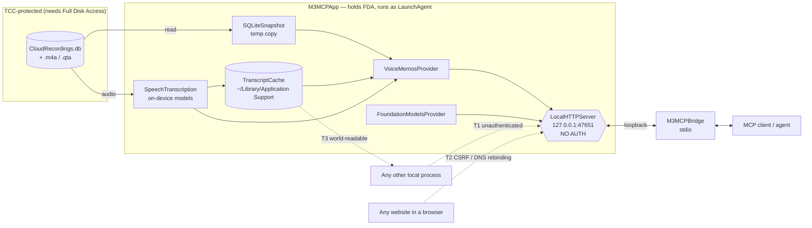

# Threat Model — Voice Memos provider, on-device summarization, local install

Status: **Draft — Awaiting Input** (see Open Questions)
Scope: `VoiceMemosProvider`, `SpeechTranscription`, `TranscriptCache`, `SQLiteSnapshot`,
`FoundationModelsProvider`, `LocalHTTPServer` exposure, `script/install_local.sh`,
`script/create_local_identity.sh`
Method: Shostack's four questions + STRIDE per component and data flow
Findings marked **[verified]** were demonstrated on a live system, not inferred.

## 1. What are we building?

A macOS app holding **Full Disk Access** reads the Voice Memos Core Data store and audio files,
transcribes them with on-device speech models, and serves the result over an **unauthenticated
loopback HTTP endpoint** to a `stdio` MCP bridge.

The security-relevant shape: the app deliberately holds a very broad privilege (FDA grants read access
to Mail, Messages, Safari history, every app container) and re-exposes derived data over a local
socket. It is a capability broker.



## 2. What can go wrong?

### T1 — Unauthenticated loopback endpoint re-exposes FDA to any local process — **HIGH**

STRIDE: Information Disclosure, Elevation of Privilege (confused deputy)
**[verified]** `LocalHTTPServer` performs no authentication, no `Host` validation, and no `Origin`
check (`grep` for `Access-Control|Origin|Host|OPTIONS` returns nothing).

Any local process — including sandboxed apps that could never read `~/Library/Mail` themselves — can
`POST /tools/mail_search`, `/tools/voicememos_read`, `/tools/contacts_search` and receive results. The
app launders its FDA privilege on behalf of unprivileged callers. macOS spends considerable effort
making TCC a real boundary; this endpoint routes around it for every provider.

Pre-existing, but this change **materially raises the impact**: the endpoint now returns full
transcripts of private voice memos, including third-party voice messages.

### T2 — Browser-reachable: CSRF today, full read via DNS rebinding — **HIGH**

STRIDE: Information Disclosure, Tampering
**[verified]** A `Content-Type: text/plain` POST is accepted and returns HTTP 200. That is a CORS
"simple request", so **any website can invoke any tool** with no preflight. A forged `Origin` header is
accepted (HTTP 200), and so is a forged `Host` header.

- Today: side effects fire blind — `permissions_request`, `ai_image_playground`, or repeated
  transcription. Responses are not readable cross-origin because no CORS headers are returned.
- With DNS rebinding: absent `Host` validation, an attacker resolves their domain to `127.0.0.1`,
  becomes same-origin with the server, and **reads every response** — mail, contacts, transcripts.

### T3 — Transcript cache de-protects TCC-protected content — **MEDIUM** *(introduced here)*

STRIDE: Information Disclosure
**[verified]** `~/Library/Application Support/M3MCP/transcripts/` is `drwxr-xr-x` with `-rw-r--r--`
files. The audio is TCC-protected; its transcribed **content** is written world-readable. Any process
running as any user on the machine reads private voice-memo text with no privilege at all.

This is a direct consequence of adding caching and is the cheapest finding to fix.

### T4 — Local signing identity is an FDA-bearing capability — **HIGH** *(introduced here)*

STRIDE: Elevation of Privilege, Spoofing
**[verified]** A three-line imposter binary, signed with `M3MCP Local Development` and carrying
`CFBundleIdentifier = de.markzimmermann.m3mcp`, **satisfies the app's designated requirement**:

```
designated => identifier "de.markzimmermann.m3mcp" and certificate root = H"c96e…"
codesign --verify -R  →  imposter satisfies the DR
```

`create_local_identity.sh` imports the key with `security import -A`, which lets **any** application
use the private key with no keychain prompt. `~/Applications/M3MCP.app` is user-writable. So any
local code execution can sign an imposter, satisfy the DR, and inherit Full Disk Access.

This is the deliberate trade-off of a stable designated requirement — it is exactly *why* the FDA grant
survives rebuilds — but it converts the certificate into a durable privilege. Ad-hoc signing has the
inverse profile: no reusable capability, but the grant breaks on every rebuild.

Not empirically confirmed: that TCC actually hands FDA to the imposter. DR satisfaction was
demonstrated; completing the escalation was deliberately not attempted.

### T5 — Prompt injection from transcript content — **MEDIUM**

STRIDE: Tampering
Transcripts are **attacker-influenced input**. Anyone who sends the user a voice message controls text
that flows into `ai_summarize` and into whatever agent polls the memos. The intended workflow — poll
every few minutes, summarize, act — is precisely the shape that turns injected instructions into
actions.

`FoundationModelsProvider` instructions say "never invent details" but contain no injection defence,
and transcripts are passed as the bare prompt rather than as delimited untrusted data.

### T6 — No path-traversal guard on `ZPATH` — **LOW**

STRIDE: Information Disclosure
`directory.appendingPathComponent(fileName)` where `fileName` is `ZPATH` from the database. The only
guard is non-emptiness. A crafted `ZPATH` (`../../…`) would make an FDA-holding process read and
transcribe an arbitrary file. Writing the database already requires FDA, which makes this low
likelihood — but values arrive via iCloud sync from other devices, and the fix is one line.

### T7 — Unbounded transcription cost — **LOW**

STRIDE: Denial of Service
`voicememos_read` triggers transcription with no rate limit or concurrency cap. Combined with T1/T2,
any local process or website can drive sustained CPU and disk use. `limit` caps search only.

### T8 — Log file in a world-readable directory — **LOW**

`AppLogger` writes `/tmp/m3mcpapp.log` (`-rw-r--r--` in a `1777` directory). **[verified]** it contains
no transcript text (0 matches for known transcript strings); `inputJSON`/`outputJSON` stay in-memory
for the UI. It does record memo filenames and UUIDs — metadata leakage only.

### Examined and found sound

- **SQL injection — not present.** All statements are string constants. The single interpolated
  identifier (`nameColumn`) is chosen from a hardcoded allowlist `["ZENCRYPTEDNAME", "ZNAME"]`
  intersected with actual table columns. Search/date filtering happens in Swift, not SQL.
- **Write-safety of the live store.** `SQLiteSnapshot` copies to a per-user temp directory (mode `0700`)
  and opens only the copy read-write; sizes and mtimes verified unchanged after repeated reads.
- **No network egress.** Transcription and summarization are on-device; no provider makes outbound
  connections.
- **Weak linking.** `FoundationModels` and `Speech` are weak-linked, so no load-time abort on macOS 15.

## 3. What are we going to do about it?

| # | Mitigation | Cost | Status |
|---|---|---|---|
| T3 | `0700` cache directory, `0600` files | trivial | **proposed now** |
| T6 | Reject `ZPATH` containing `/` or `..`; resolve and confirm parent | trivial | **proposed now** |
| T5 | Wrap transcripts in explicit untrusted-data delimiters; warn in tool description | small | **proposed now** |
| T4 | Drop `-A` from `security import`; document that the cert is an FDA-bearing capability; offer a locked build keychain | small | **proposed now** |
| T1 | Per-install bearer token: app writes a secret to a `0600` file, bridge reads it, server requires it | medium | **needs owner decision** — breaks existing bridge setups |
| T2 | Validate `Host` against `127.0.0.1`/`[::1]`; reject non-JSON `Content-Type`; reject requests carrying `Origin` | small | **needs owner decision** |
| T7 | Serialize transcription; cap concurrent jobs | small | deferred |
| T8 | Log to `~/Library/Logs`, mode `0600` | trivial | deferred |

T1 and T2 are the highest-value changes but they alter the app↔bridge contract and affect every
provider, not just Voice Memos. They belong to the repository owner, not to this feature branch.

## 4. Did we do a good job?

Verified by demonstration: T1, T2, T3, T4, T8, plus the four "found sound" items.
Not verified: whether TCC completes the T4 escalation (deliberately not attempted); T5 exploitability
against the specific on-device model; T6 against a maliciously synced `ZPATH`.

## Assumptions

1. The attacker has unprivileged local code execution, or can get the user to load a web page. Both are
   standard assumptions for a local service.
2. The Voice Memos store is written only by Apple's app; values may originate on other devices via
   iCloud and are therefore not fully trusted.
3. Full Disk Access is a boundary worth defending — a malicious local app should *not* be able to read
   Mail — rather than a formality.
4. Voice memo content is sensitive and may involve third parties who never consented to processing.

## Open Questions

1. **T1 auth model** — bearer token in a `0600` file, or Unix domain socket with filesystem
   permissions? The socket is stronger and removes the browser reachability of T2 entirely, but is a
   larger change to `LocalAppClient`/`LocalHTTPServer`.
2. **T4 posture** — accept the certificate-as-capability trade-off for a durable FDA grant, or move the
   identity into a keychain that stays locked and prompts per build?
3. **T5 scope** — should the provider refuse to auto-summarize, or is delimiting plus a documented
   warning sufficient given the caller decides what to do with the output?
4. Should T1/T2 be raised as an upstream issue on the repository rather than bundled into the Voice
   Memos pull request?
